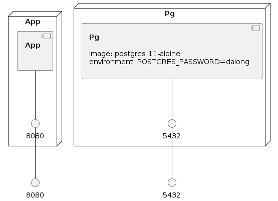

# graphqlize-docker-compose
graphqlize-docker-compose


## how to running


> all need init datas first

* local

```code

docker-compose up -d

mvn spring-boot:run -Plocal

```

* docker

```code
mvn clean package -Pdocker -Dmaven.test.skip=true 
docker-compose build
docker-compose up -d
```

* view result

```code
playground:  http://localhost:8080/playground.html 
voyager: http://localhost:8080/voyager.html

```

### Infrastructure model

